Clover Phenotype Pipeline
================
NChain Project
16/06/2017 - 14:34:26

-   [Inflection points](#inflection-points)
-   [Growth curves for all Cameras](#growth-curves-for-all-cameras)

### Inflection points

     [1]  0.42857143  0.19047619  0.71428571  0.76190476  0.71428571
     [6]  0.66666667  0.52380952  0.47619048  0.52380952  0.47619048
    [11]  0.42857143  0.38095238  0.33333333  0.28571429  0.14285714
    [16]  0.19047619 -0.04761905 -0.09523810 -0.04761905 -0.09523810
    [21] -0.04761905

    Error in labs(x = "", title = Rb1063.SM15$Camera[0]): object 'Rb1063.SM15' not found

     [1] -1.00000000 -0.95238095 -0.90476190 -0.76190476 -0.71428571
     [6] -0.66666667 -0.42857143  0.19047619 -0.33333333 -0.19047619
    [11] -0.14285714 -0.09523810 -0.04761905 -0.09523810 -0.04761905
    [16]  0.00000000 -0.23809524 -0.19047619 -0.14285714 -0.09523810
    [21] -0.04761905

     [1]  0.71428571  0.76190476  0.52380952  0.57142857  0.42857143
     [6]  0.38095238  0.52380952  0.57142857  0.42857143  0.47619048
    [11]  0.23809524  0.28571429  0.33333333 -0.19047619  0.04761905
    [16] -0.09523810 -0.14285714  0.00000000 -0.04761905  0.00000000
    [21] -0.04761905

     [1] -0.80952381 -0.76190476 -0.71428571 -0.47619048 -0.61904762
     [6] -0.66666667 -0.61904762 -0.57142857 -0.52380952 -0.38095238
    [11] -0.42857143 -0.38095238  0.14285714 -0.28571429 -0.04761905
    [16] -0.19047619 -0.14285714 -0.09523810 -0.04761905  0.00000000
    [21] -0.04761905

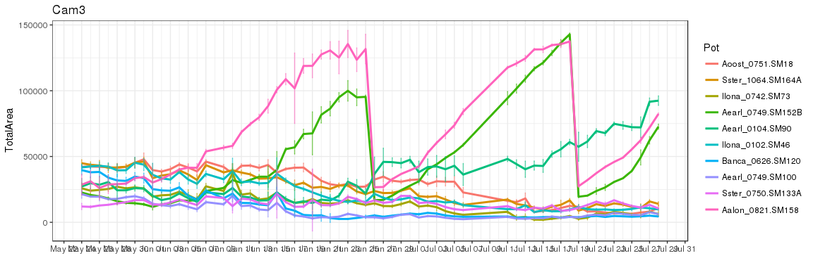

     [1] -0.90476190 -0.85714286 -0.80952381 -0.76190476 -0.71428571
     [6] -0.76190476 -0.71428571 -0.19047619 -0.61904762 -0.38095238
    [11] -0.52380952 -0.38095238 -0.23809524 -0.38095238 -0.33333333
    [16] -0.28571429 -0.23809524 -0.19047619 -0.14285714 -0.09523810
    [21] -0.04761905

     [1] -1.00000000 -0.66666667 -0.61904762 -0.57142857 -0.52380952
     [6] -0.76190476 -0.71428571 -0.66666667 -0.52380952 -0.38095238
    [11] -0.42857143 -0.28571429 -0.23809524 -0.38095238 -0.33333333
    [16] -0.28571429 -0.23809524 -0.19047619 -0.14285714 -0.09523810
    [21] -0.04761905

     [1] -1.00000000 -0.95238095 -0.90476190 -0.85714286 -0.80952381
     [6] -0.76190476 -0.71428571 -0.57142857 -0.52380952 -0.47619048
    [11] -0.52380952 -0.47619048 -0.23809524 -0.38095238 -0.33333333
    [16] -0.28571429 -0.23809524 -0.19047619 -0.14285714 -0.09523810
    [21] -0.04761905

     [1] -0.33333333 -0.28571429 -0.14285714 -0.09523810  0.14285714
     [6]  0.19047619 -0.04761905 -0.09523810  0.33333333  0.38095238
    [11]  0.42857143  0.09523810 -0.23809524 -0.28571429 -0.33333333
    [16] -0.28571429 -0.23809524 -0.09523810 -0.04761905  0.00000000
    [21] -0.04761905

     [1] -0.90476190 -0.85714286 -0.80952381 -0.47619048 -0.61904762
     [6] -0.66666667 -0.61904762 -0.57142857 -0.33333333 -0.28571429
    [11] -0.23809524 -0.19047619  0.04761905 -0.09523810 -0.04761905
    [16]  0.00000000 -0.14285714 -0.19047619 -0.14285714 -0.09523810
    [21] -0.04761905

     [1] -0.80952381 -0.76190476  0.33333333 -0.66666667 -0.52380952
     [6] -0.57142857 -0.61904762 -0.66666667 -0.61904762 -0.38095238
    [11] -0.42857143 -0.38095238 -0.23809524 -0.38095238 -0.33333333
    [16] -0.28571429 -0.23809524 -0.19047619 -0.14285714 -0.09523810
    [21] -0.04761905

     [1] -1.00000000 -0.95238095 -0.90476190 -0.85714286 -0.80952381
     [6] -0.76190476 -0.71428571 -0.66666667 -0.61904762 -0.38095238
    [11] -0.52380952 -0.38095238 -0.23809524 -0.38095238 -0.33333333
    [16] -0.19047619 -0.23809524 -0.19047619 -0.14285714 -0.09523810
    [21] -0.04761905

     [1] -1.00000000 -0.95238095 -0.90476190 -0.85714286 -0.80952381
     [6] -0.66666667 -0.71428571 -0.66666667 -0.61904762 -0.47619048
    [11] -0.52380952 -0.47619048 -0.33333333 -0.38095238 -0.14285714
    [16] -0.09523810 -0.23809524 -0.19047619 -0.14285714 -0.09523810
    [21] -0.04761905

     [1] -1.00000000 -0.95238095 -0.90476190 -0.76190476 -0.80952381
     [6] -0.76190476 -0.61904762 -0.57142857 -0.52380952 -0.28571429
    [11] -0.33333333 -0.28571429 -0.23809524 -0.38095238 -0.33333333
    [16] -0.28571429 -0.23809524 -0.19047619 -0.14285714 -0.09523810
    [21] -0.04761905

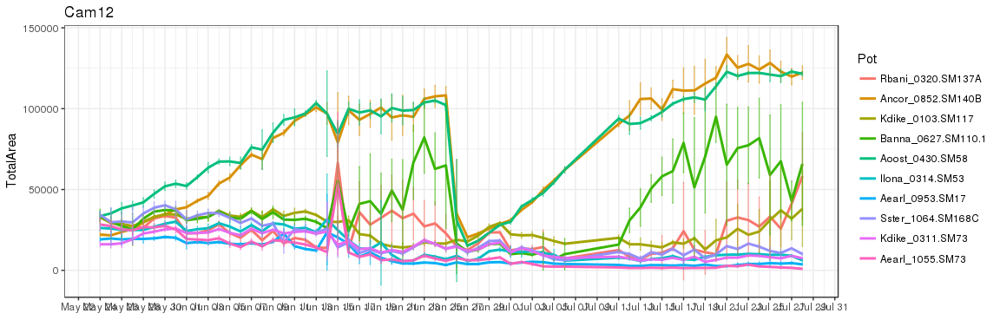

     [1] -1.00000000 -0.95238095 -0.90476190 -0.85714286 -0.80952381
     [6] -0.76190476 -0.71428571 -0.66666667 -0.52380952 -0.19047619
    [11] -0.42857143 -0.19047619 -0.04761905 -0.38095238 -0.33333333
    [16] -0.28571429 -0.23809524 -0.19047619 -0.14285714 -0.09523810
    [21] -0.04761905

     [1] -1.00000000 -0.95238095 -0.90476190 -0.57142857 -0.52380952
     [6] -0.76190476 -0.71428571 -0.66666667 -0.42857143 -0.28571429
    [11] -0.52380952 -0.38095238 -0.23809524 -0.38095238 -0.33333333
    [16] -0.28571429 -0.23809524 -0.19047619 -0.04761905 -0.09523810
    [21] -0.04761905

     [1] -1.00000000 -0.85714286 -0.80952381 -0.76190476 -0.80952381
     [6] -0.76190476 -0.71428571 -0.66666667 -0.61904762 -0.38095238
    [11] -0.42857143 -0.38095238 -0.23809524 -0.38095238 -0.33333333
    [16] -0.28571429 -0.23809524 -0.19047619 -0.14285714 -0.09523810
    [21] -0.04761905

     [1] -1.00000000 -0.95238095 -0.90476190 -0.85714286 -0.80952381
     [6] -0.76190476 -0.71428571 -0.66666667 -0.61904762 -0.38095238
    [11] -0.52380952 -0.38095238 -0.23809524 -0.38095238 -0.33333333
    [16] -0.28571429 -0.23809524 -0.19047619 -0.14285714 -0.09523810
    [21] -0.04761905

     [1] -0.80952381 -0.66666667 -0.61904762 -0.47619048 -0.52380952
     [6] -0.66666667 -0.71428571 -0.66666667 -0.61904762 -0.28571429
    [11] -0.42857143 -0.28571429  0.04761905 -0.38095238 -0.33333333
    [16] -0.19047619 -0.23809524 -0.19047619 -0.14285714 -0.09523810
    [21] -0.04761905

     [1] -1.00000000 -0.66666667 -0.61904762 -0.57142857 -0.52380952
     [6] -0.76190476 -0.71428571 -0.66666667 -0.23809524 -0.19047619
    [11] -0.42857143 -0.09523810  0.14285714 -0.38095238 -0.23809524
    [16] -0.09523810 -0.14285714 -0.09523810 -0.04761905 -0.09523810
    [21] -0.04761905

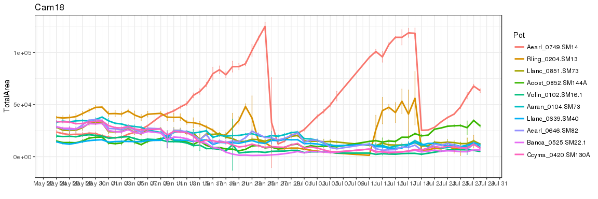

     [1] -0.42857143 -0.38095238 -0.33333333 -0.19047619  0.23809524
     [6] -0.19047619 -0.14285714 -0.19047619  0.42857143  0.38095238
    [11] -0.04761905  0.09523810  0.14285714 -0.38095238 -0.23809524
    [16] -0.19047619 -0.23809524 -0.19047619 -0.14285714 -0.09523810
    [21] -0.04761905

     [1] -1.00000000 -0.95238095 -0.90476190 -0.85714286 -0.80952381
     [6] -0.76190476 -0.71428571 -0.66666667 -0.61904762 -0.57142857
    [11] -0.42857143 -0.28571429 -0.14285714 -0.28571429 -0.23809524
    [16] -0.19047619 -0.14285714 -0.09523810 -0.04761905  0.00000000
    [21] -0.04761905

     [1] -0.90476190 -0.85714286 -0.80952381 -0.76190476 -0.71428571
     [6] -0.76190476 -0.71428571 -0.57142857 -0.61904762 -0.28571429
    [11] -0.52380952 -0.38095238 -0.23809524 -0.38095238 -0.33333333
    [16] -0.28571429 -0.14285714 -0.19047619 -0.14285714 -0.09523810
    [21] -0.04761905

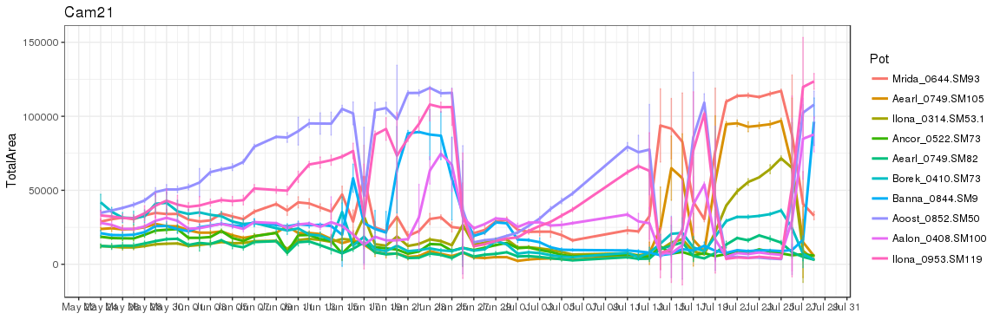

     [1] -1.00000000 -0.95238095 -0.90476190 -0.85714286 -0.80952381
     [6] -0.76190476 -0.71428571 -0.66666667 -0.04761905 -0.38095238
    [11] -0.42857143 -0.38095238 -0.23809524 -0.38095238 -0.23809524
    [16] -0.28571429 -0.23809524  0.00000000  0.04761905 -0.09523810
    [21] -0.04761905

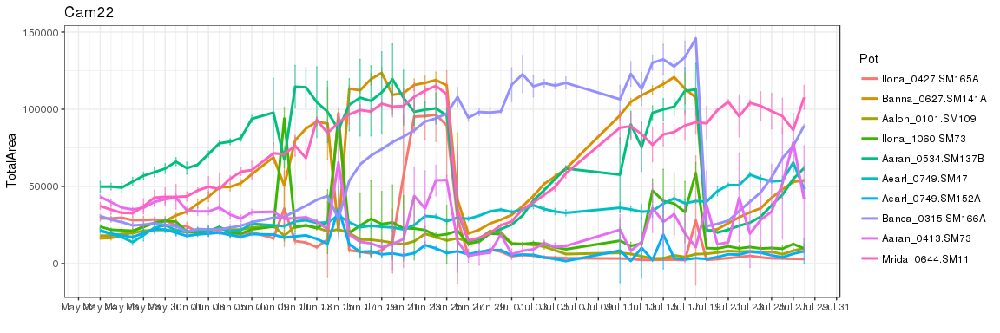

     [1] -0.61904762 -0.95238095 -0.90476190 -0.85714286 -0.80952381
     [6] -0.76190476 -0.71428571 -0.19047619 -0.52380952 -0.57142857
    [11] -0.52380952 -0.47619048 -0.42857143 -0.38095238 -0.23809524
    [16] -0.28571429 -0.23809524 -0.19047619 -0.14285714 -0.09523810
    [21] -0.04761905

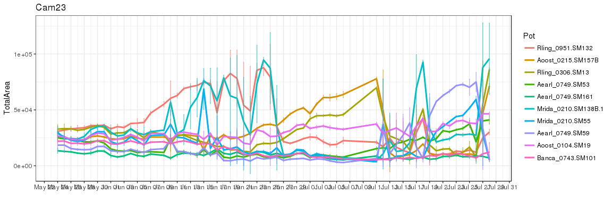

     [1] -0.42857143 -0.19047619 -0.23809524  0.00000000 -0.80952381
     [6] -0.76190476 -0.71428571  0.09523810 -0.52380952 -0.57142857
    [11] -0.52380952 -0.47619048 -0.23809524 -0.09523810 -0.23809524
    [16] -0.28571429 -0.23809524  0.00000000  0.04761905 -0.09523810
    [21] -0.04761905

     [1] -1.00000000 -0.95238095 -0.90476190 -0.85714286 -0.80952381
     [6] -0.76190476 -0.71428571 -0.66666667 -0.61904762 -0.57142857
    [11] -0.42857143 -0.47619048  0.04761905 -0.28571429 -0.33333333
    [16] -0.28571429 -0.23809524 -0.19047619 -0.04761905 -0.09523810
    [21] -0.04761905

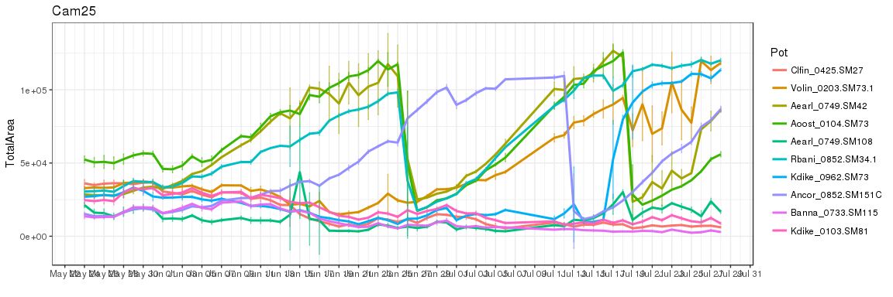

     [1] -0.90476190 -0.85714286 -0.80952381 -0.76190476 -0.71428571
     [6] -0.66666667 -0.71428571 -0.66666667 -0.61904762 -0.57142857
    [11] -0.52380952 -0.47619048 -0.33333333 -0.38095238 -0.23809524
    [16] -0.28571429 -0.23809524 -0.19047619 -0.14285714 -0.09523810
    [21] -0.04761905

     [1] -1.00000000 -0.95238095 -0.90476190 -0.85714286 -0.71428571
     [6] -0.57142857 -0.71428571 -0.66666667 -0.61904762 -0.47619048
    [11] -0.52380952 -0.38095238 -0.33333333 -0.38095238 -0.33333333
    [16] -0.28571429 -0.23809524  0.00000000  0.04761905 -0.09523810
    [21] -0.04761905

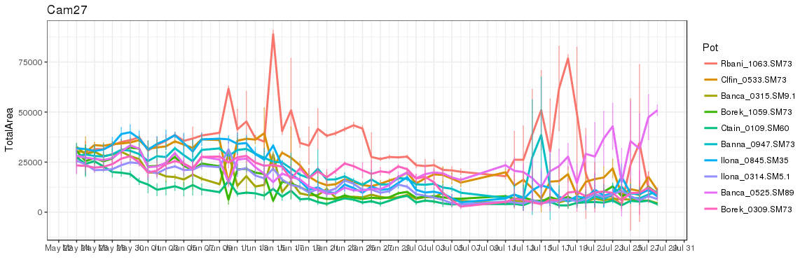

     [1] -1.00000000 -0.95238095 -0.90476190 -0.85714286 -0.80952381
     [6] -0.76190476 -0.71428571 -0.66666667 -0.52380952 -0.19047619
    [11] -0.23809524  0.00000000 -0.14285714 -0.38095238 -0.33333333
    [16] -0.28571429 -0.23809524 -0.19047619 -0.14285714 -0.09523810
    [21] -0.04761905

     [1] -0.80952381 -0.76190476 -0.61904762 -0.66666667 -0.42857143
     [6] -0.38095238 -0.33333333 -0.19047619 -0.14285714  0.09523810
    [11]  0.04761905  0.19047619  0.23809524 -0.09523810 -0.14285714
    [16]  0.09523810 -0.04761905 -0.19047619 -0.14285714 -0.09523810
    [21] -0.04761905

     [1]  0.14285714  0.00000000 -0.04761905  0.28571429  0.52380952
     [6]  0.57142857  0.33333333  0.38095238  0.52380952  0.47619048
    [11]  0.42857143  0.28571429  0.33333333  0.28571429  0.23809524
    [16]  0.19047619  0.14285714  0.09523810  0.04761905  0.00000000
    [21] -0.04761905

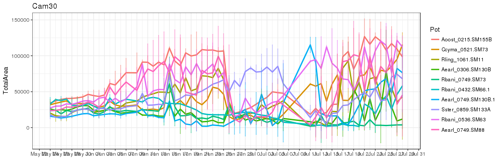

     [1] -1.00000000 -0.95238095 -0.90476190 -0.85714286 -0.80952381
     [6] -0.76190476 -0.71428571 -0.66666667 -0.61904762 -0.38095238
    [11] -0.52380952 -0.28571429 -0.14285714 -0.38095238 -0.33333333
    [16] -0.28571429 -0.23809524 -0.19047619 -0.04761905 -0.09523810
    [21] -0.04761905

     [1]  0.14285714  0.19047619 -0.04761905 -0.38095238  0.04761905
     [6] -0.57142857 -0.04761905  0.57142857  0.23809524  0.38095238
    [11] -0.04761905  0.19047619  0.33333333 -0.28571429 -0.14285714
    [16]  0.09523810 -0.04761905 -0.09523810 -0.04761905  0.00000000
    [21] -0.04761905

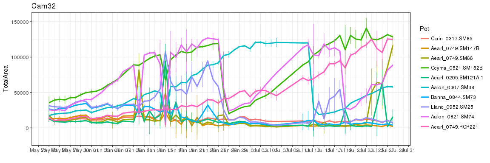

     [1] -0.90476190 -0.95238095 -0.61904762 -0.66666667 -0.71428571
     [6] -0.76190476 -0.71428571 -0.38095238 -0.33333333 -0.28571429
    [11] -0.52380952 -0.28571429  0.04761905 -0.38095238 -0.33333333
    [16] -0.28571429 -0.23809524 -0.19047619 -0.14285714 -0.09523810
    [21] -0.04761905

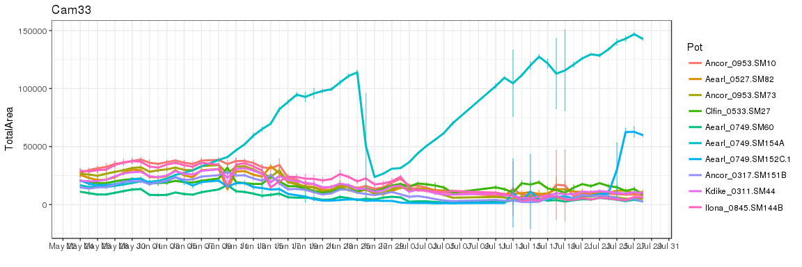

     [1] -0.90476190 -0.85714286 -0.71428571  0.19047619 -0.33333333
     [6]  0.38095238 -0.52380952 -0.66666667  0.42857143  0.38095238
    [11] -0.42857143 -0.28571429 -0.23809524 -0.38095238 -0.33333333
    [16] -0.28571429 -0.23809524 -0.19047619 -0.14285714 -0.09523810
    [21] -0.04761905

     [1] -1.00000000 -0.95238095 -0.90476190 -0.85714286 -0.71428571
     [6] -0.76190476 -0.71428571 -0.28571429 -0.33333333 -0.28571429
    [11] -0.42857143 -0.38095238 -0.23809524 -0.38095238 -0.33333333
    [16] -0.28571429 -0.23809524 -0.19047619 -0.14285714 -0.09523810
    [21] -0.04761905

     [1]  0.42857143  0.19047619  0.23809524  0.38095238  0.61904762
     [6]  0.57142857  0.52380952  0.57142857  0.52380952  0.47619048
    [11]  0.42857143  0.38095238  0.33333333  0.19047619  0.23809524
    [16]  0.19047619  0.14285714  0.09523810  0.04761905  0.00000000
    [21] -0.04761905

     [1] -0.71428571 -0.85714286 -0.52380952 -0.28571429 -0.52380952
     [6] -0.66666667 -0.71428571 -0.66666667  0.14285714 -0.19047619
    [11] -0.52380952 -0.28571429  0.04761905 -0.38095238 -0.33333333
    [16] -0.28571429 -0.23809524 -0.19047619 -0.14285714 -0.09523810
    [21] -0.04761905

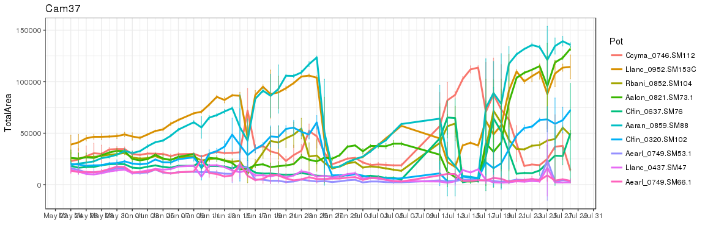

     [1] -1.00000000 -0.95238095 -0.80952381 -0.76190476 -0.71428571
     [6] -0.76190476 -0.71428571 -0.47619048 -0.33333333 -0.28571429
    [11] -0.52380952 -0.38095238 -0.23809524 -0.38095238 -0.33333333
    [16] -0.28571429 -0.23809524 -0.19047619 -0.14285714 -0.09523810
    [21] -0.04761905

     [1] -1.00000000 -0.95238095 -0.90476190 -0.85714286 -0.80952381
     [6] -0.76190476 -0.71428571 -0.66666667 -0.52380952 -0.47619048
    [11] -0.52380952 -0.47619048 -0.33333333 -0.38095238 -0.33333333
    [16] -0.28571429 -0.23809524 -0.19047619 -0.04761905 -0.09523810
    [21] -0.04761905

     [1] -0.71428571 -0.66666667 -0.61904762 -0.57142857 -0.52380952
     [6] -0.76190476 -0.71428571 -0.66666667 -0.61904762 -0.57142857
    [11] -0.52380952 -0.47619048 -0.14285714 -0.38095238 -0.33333333
    [16] -0.28571429 -0.23809524 -0.19047619 -0.14285714 -0.09523810
    [21] -0.04761905

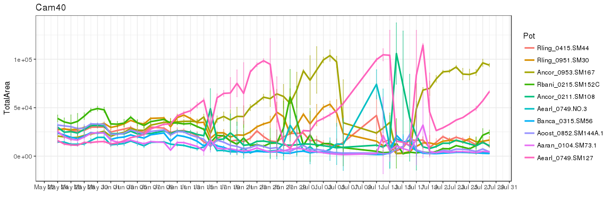

     [1]  0.61904762  0.66666667  0.71428571  0.66666667  0.61904762
     [6]  0.57142857  0.61904762  0.47619048  0.52380952  0.47619048
    [11]  0.42857143  0.38095238  0.33333333  0.09523810 -0.14285714
    [16] -0.09523810 -0.14285714 -0.19047619 -0.14285714 -0.09523810
    [21] -0.04761905

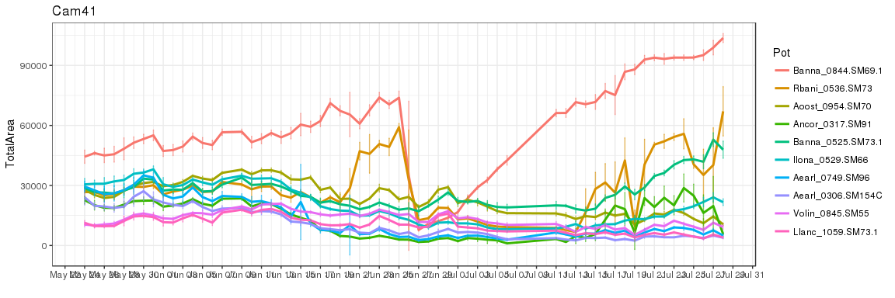

     [1]  0.71428571  0.76190476  0.80952381  0.76190476  0.71428571
     [6]  0.47619048  0.42857143  0.38095238  0.42857143  0.47619048
    [11]  0.14285714  0.28571429  0.23809524  0.28571429  0.14285714
    [16]  0.19047619  0.14285714  0.00000000  0.04761905  0.00000000
    [21] -0.04761905

     [1]  0.80952381  0.85714286  0.14285714  0.19047619  0.14285714
     [6]  0.28571429  0.33333333  0.38095238  0.42857143  0.47619048
    [11]  0.42857143  0.38095238  0.33333333  0.28571429  0.23809524
    [16]  0.19047619  0.14285714  0.09523810 -0.14285714 -0.09523810
    [21] -0.04761905

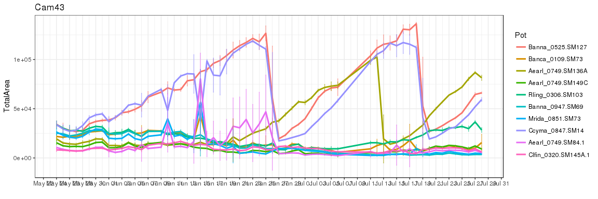

     [1]  0.52380952  0.57142857  0.71428571  0.66666667  0.71428571
     [6]  0.57142857  0.61904762  0.47619048  0.52380952  0.47619048
    [11]  0.42857143  0.38095238  0.33333333  0.28571429  0.23809524
    [16]  0.19047619  0.14285714  0.09523810  0.04761905 -0.09523810
    [21] -0.04761905

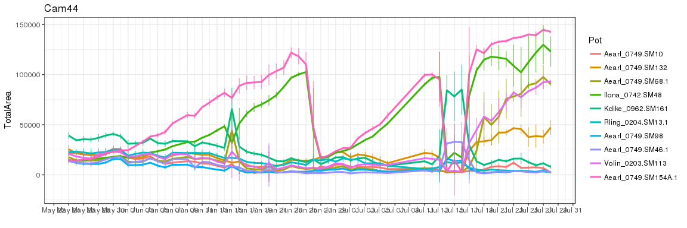

     [1] -1.00000000 -0.95238095 -0.80952381  0.09523810 -0.04761905
     [6] -0.57142857 -0.61904762 -0.66666667 -0.61904762 -0.57142857
    [11] -0.52380952 -0.47619048 -0.42857143 -0.28571429 -0.23809524
    [16] -0.19047619 -0.14285714 -0.09523810 -0.04761905 -0.09523810
    [21] -0.04761905

     [1] -0.80952381 -0.76190476 -0.80952381 -0.76190476 -0.71428571
     [6] -0.66666667 -0.61904762 -0.47619048 -0.42857143  0.47619048
    [11]  0.23809524  0.28571429  0.33333333  0.19047619 -0.04761905
    [16] -0.09523810 -0.04761905 -0.09523810 -0.14285714 -0.09523810
    [21] -0.04761905

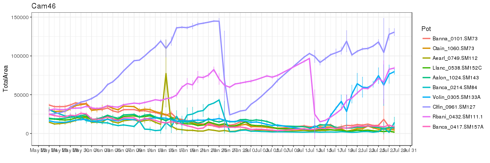

     [1]  0.04761905  0.09523810  0.14285714  0.00000000 -0.61904762
     [6] -0.47619048 -0.52380952 -0.47619048  0.04761905  0.28571429
    [11]  0.14285714  0.19047619  0.23809524  0.09523810  0.04761905
    [16]  0.00000000 -0.04761905  0.00000000 -0.04761905 -0.09523810
    [21] -0.04761905

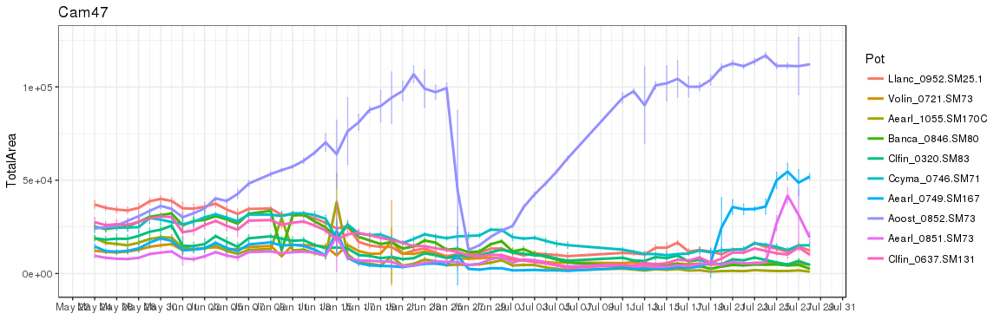

     [1] -0.23809524  0.00000000  0.42857143  0.47619048  0.33333333
     [6] -0.19047619 -0.23809524 -0.09523810  0.04761905  0.00000000
    [11] -0.23809524  0.00000000  0.04761905 -0.28571429 -0.23809524
    [16] -0.28571429 -0.23809524 -0.19047619 -0.14285714  0.00000000
    [21] -0.04761905

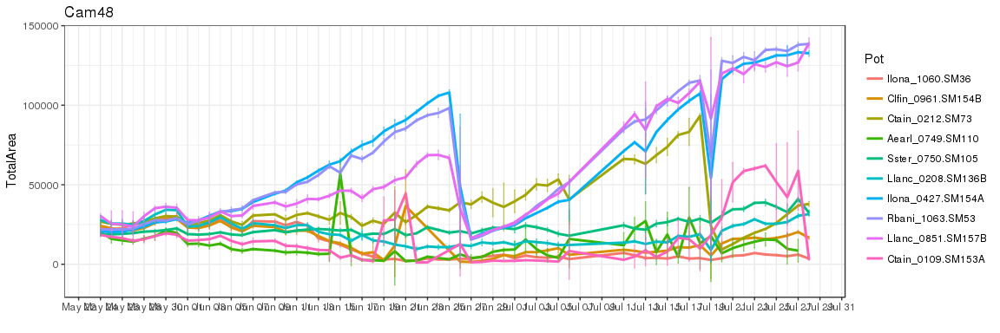

     [1] -0.52380952 -0.28571429 -0.04761905  0.00000000 -0.33333333
     [6] -0.76190476 -0.71428571 -0.66666667 -0.42857143 -0.28571429
    [11] -0.23809524 -0.19047619 -0.14285714 -0.09523810 -0.04761905
    [16]  0.00000000 -0.04761905  0.09523810 -0.04761905 -0.09523810
    [21] -0.04761905

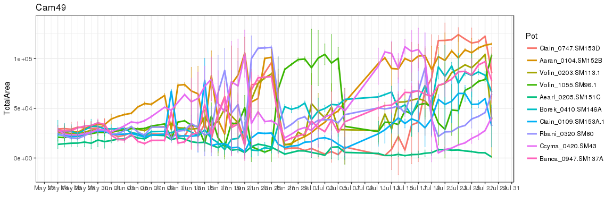

     [1]  0.04761905  0.09523810  0.23809524  0.66666667  0.42857143
     [6]  0.38095238  0.42857143  0.47619048  0.52380952  0.47619048
    [11]  0.23809524  0.28571429  0.33333333  0.28571429  0.14285714
    [16]  0.09523810  0.04761905  0.09523810 -0.14285714 -0.09523810
    [21] -0.04761905

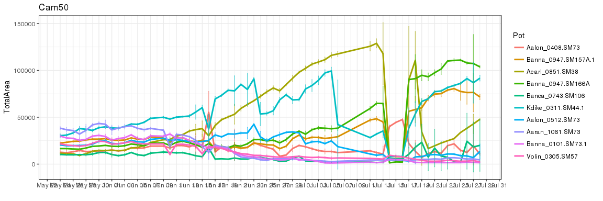

     [1] -1.00000000 -0.95238095 -0.90476190 -0.85714286 -0.80952381
     [6] -0.76190476 -0.71428571 -0.66666667 -0.61904762 -0.19047619
    [11] -0.23809524  0.09523810  0.14285714 -0.38095238 -0.33333333
    [16] -0.28571429 -0.23809524 -0.19047619 -0.14285714 -0.09523810
    [21] -0.04761905

     [1]  0.61904762  0.66666667  0.71428571  0.76190476  0.61904762
     [6]  0.47619048  0.33333333  0.38095238  0.52380952  0.47619048
    [11]  0.23809524  0.28571429  0.14285714  0.09523810  0.23809524
    [16]  0.19047619  0.04761905  0.09523810 -0.04761905 -0.09523810
    [21] -0.04761905

     [1] -0.04761905  0.00000000  0.04761905 -0.09523810  0.04761905
     [6]  0.38095238  0.14285714  0.19047619  0.42857143  0.47619048
    [11]  0.42857143  0.38095238  0.33333333  0.28571429 -0.14285714
    [16]  0.19047619  0.04761905  0.00000000 -0.04761905 -0.09523810
    [21] -0.04761905

     [1]  0.14285714  0.28571429  0.14285714  0.09523810  0.14285714
     [6]  0.19047619 -0.04761905 -0.28571429 -0.23809524 -0.19047619
    [11] -0.33333333 -0.28571429 -0.23809524 -0.19047619 -0.23809524
    [16] -0.28571429 -0.23809524 -0.19047619 -0.14285714 -0.09523810
    [21] -0.04761905

     [1] -1.00000000 -0.95238095 -0.90476190 -0.66666667 -0.61904762
     [6] -0.76190476 -0.71428571 -0.66666667 -0.61904762 -0.47619048
    [11] -0.52380952 -0.38095238 -0.14285714 -0.09523810 -0.04761905
    [16]  0.00000000 -0.04761905 -0.09523810 -0.04761905  0.00000000
    [21] -0.04761905

     [1] -0.04761905  0.09523810  0.23809524  0.38095238 -0.04761905
     [6]  0.28571429  0.04761905  0.28571429  0.42857143  0.47619048
    [11]  0.23809524  0.19047619  0.23809524  0.28571429 -0.33333333
    [16] -0.28571429 -0.23809524 -0.19047619 -0.14285714 -0.09523810
    [21] -0.04761905

     [1]  0.52380952  0.57142857  0.42857143  0.38095238  0.33333333
     [6]  0.28571429  0.33333333  0.09523810  0.14285714  0.09523810
    [11] -0.14285714 -0.38095238 -0.33333333 -0.38095238  0.14285714
    [16]  0.19047619  0.14285714 -0.19047619 -0.04761905 -0.09523810
    [21] -0.04761905

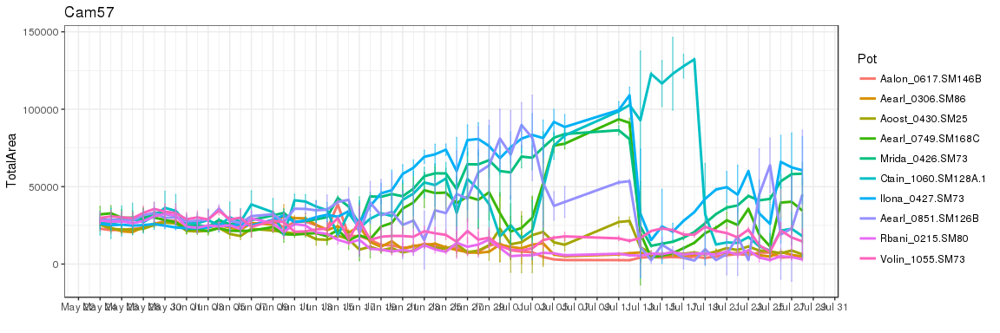

     [1] -0.20 -0.15  0.00 -0.05 -0.30 -0.15 -0.40 -0.65  0.00  0.05  0.10
    [12] -0.15 -0.40 -0.35  0.00  0.05 -0.20 -0.15 -0.10 -0.05

     [1]  0.04761905  0.09523810 -0.04761905  0.09523810  0.04761905
     [6]  0.19047619  0.14285714  0.00000000  0.14285714  0.19047619
    [11]  0.14285714  0.19047619  0.23809524  0.28571429  0.04761905
    [16]  0.09523810 -0.14285714 -0.09523810 -0.04761905  0.00000000
    [21] -0.04761905

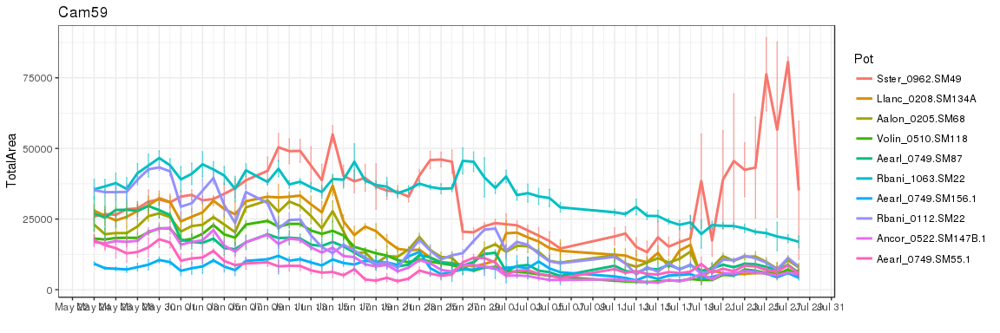

     [1]  0.52380952  0.47619048  0.61904762  0.66666667  0.61904762
     [6]  0.66666667  0.61904762  0.38095238  0.52380952  0.47619048
    [11]  0.23809524  0.28571429  0.33333333  0.28571429  0.23809524
    [16]  0.19047619  0.14285714  0.09523810  0.04761905  0.00000000
    [21] -0.04761905

     [1]  0.61904762  0.66666667  0.52380952  0.09523810  0.23809524
     [6]  0.19047619  0.33333333  0.28571429  0.42857143  0.38095238
    [11]  0.33333333  0.09523810  0.04761905  0.09523810 -0.14285714
    [16]  0.19047619 -0.23809524 -0.19047619 -0.14285714 -0.09523810
    [21] -0.04761905

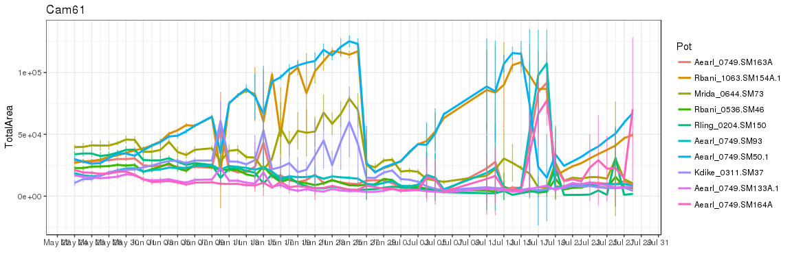

     [1]  0.80952381  0.76190476  0.71428571  0.66666667  0.52380952
     [6]  0.38095238  0.33333333  0.00000000  0.04761905 -0.19047619
    [11] -0.42857143 -0.09523810  0.23809524 -0.19047619 -0.33333333
    [16] -0.28571429 -0.04761905  0.09523810  0.04761905 -0.09523810
    [21] -0.04761905

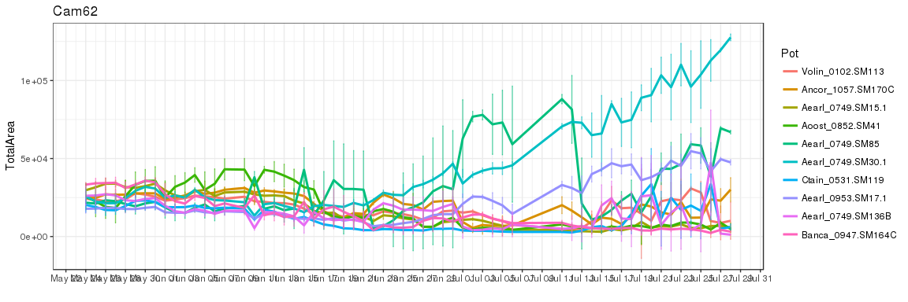

     [1]  0.52380952  0.66666667  0.71428571  0.76190476  0.71428571
     [6]  0.57142857  0.52380952  0.47619048  0.52380952  0.38095238
    [11] -0.04761905 -0.09523810  0.23809524 -0.28571429 -0.33333333
    [16] -0.28571429 -0.23809524 -0.19047619 -0.04761905 -0.09523810
    [21] -0.04761905

     [1]  0.14285714  0.28571429  0.33333333  0.28571429  0.42857143
     [6]  0.38095238  0.14285714  0.19047619  0.42857143  0.47619048
    [11]  0.23809524  0.09523810  0.04761905  0.09523810  0.14285714
    [16]  0.19047619 -0.14285714  0.00000000 -0.04761905 -0.09523810
    [21] -0.04761905

     [1]  0.61904762  0.57142857  0.61904762  0.66666667  0.71428571
     [6]  0.57142857  0.42857143  0.38095238  0.42857143  0.47619048
    [11]  0.23809524  0.28571429  0.33333333  0.28571429  0.23809524
    [16] -0.09523810  0.04761905  0.09523810  0.04761905  0.00000000
    [21] -0.04761905

     [1]  0.71428571  0.66666667  0.71428571  0.76190476  0.71428571
     [6]  0.38095238  0.42857143  0.47619048  0.52380952  0.47619048
    [11]  0.42857143  0.38095238  0.33333333  0.28571429  0.14285714
    [16]  0.19047619  0.14285714  0.09523810  0.04761905  0.00000000
    [21] -0.04761905

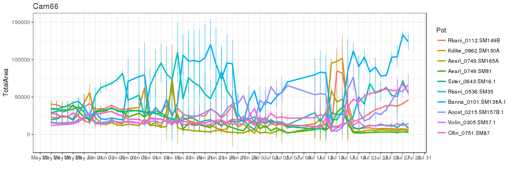

     [1] -0.90476190 -0.76190476 -0.61904762  0.47619048  0.42857143
     [6] -0.38095238 -0.42857143 -0.28571429  0.14285714 -0.28571429
    [11] -0.52380952 -0.47619048 -0.42857143 -0.38095238 -0.33333333
    [16] -0.28571429 -0.23809524 -0.09523810 -0.04761905  0.00000000
    [21] -0.04761905

     [1] -0.33333333 -0.28571429 -0.04761905  0.09523810  0.14285714
     [6]  0.28571429  0.23809524  0.28571429  0.42857143  0.38095238
    [11]  0.42857143  0.00000000 -0.04761905  0.19047619  0.04761905
    [16] -0.28571429 -0.04761905 -0.19047619 -0.14285714 -0.09523810
    [21] -0.04761905

     [1] -0.71428571 -0.38095238 -0.33333333 -0.38095238 -0.61904762
     [6] -0.66666667 -0.61904762 -0.57142857 -0.42857143 -0.38095238
    [11] -0.42857143 -0.38095238  0.23809524 -0.28571429 -0.23809524
    [16] -0.09523810 -0.04761905 -0.09523810 -0.14285714 -0.09523810
    [21] -0.04761905

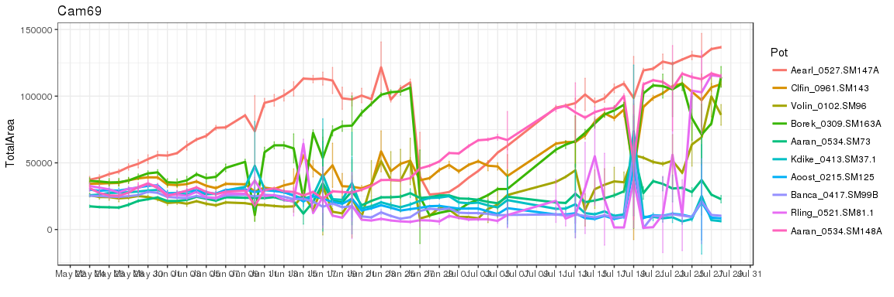

     [1] -0.90476190 -0.38095238 -0.52380952 -0.57142857 -0.61904762
     [6] -0.76190476 -0.71428571 -0.66666667 -0.33333333 -0.28571429
    [11] -0.52380952 -0.09523810  0.14285714  0.09523810 -0.14285714
    [16]  0.09523810 -0.04761905 -0.19047619 -0.14285714 -0.09523810
    [21] -0.04761905

     [1]  0.52380952  0.28571429  0.23809524  0.47619048  0.52380952
     [6]  0.57142857  0.52380952  0.57142857  0.52380952  0.47619048
    [11]  0.33333333  0.38095238  0.33333333  0.28571429  0.14285714
    [16] -0.09523810  0.04761905 -0.09523810 -0.14285714 -0.09523810
    [21] -0.04761905

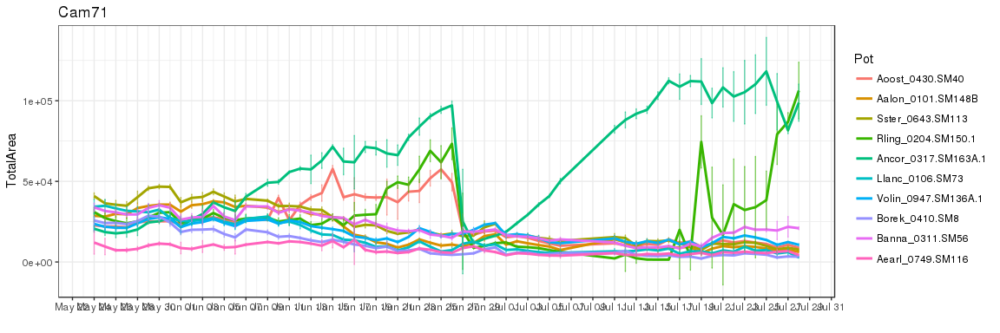

     [1]  0.61904762  0.09523810  0.23809524  0.19047619  0.23809524
     [6]  0.28571429  0.52380952  0.38095238  0.52380952  0.47619048
    [11]  0.33333333  0.38095238  0.33333333  0.28571429  0.14285714
    [16]  0.19047619  0.04761905 -0.09523810 -0.14285714 -0.09523810
    [21] -0.04761905

     [1]  0.42857143  0.66666667  0.71428571  0.47619048  0.61904762
     [6]  0.66666667  0.61904762  0.47619048  0.52380952  0.47619048
    [11]  0.33333333  0.38095238  0.33333333  0.28571429 -0.23809524
    [16] -0.28571429 -0.23809524 -0.19047619 -0.14285714 -0.09523810
    [21] -0.04761905

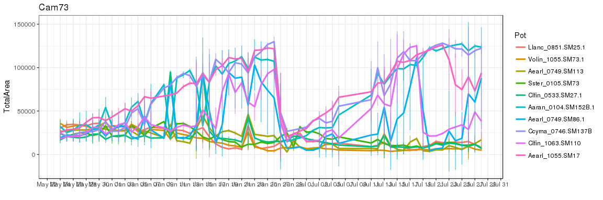

     [1] -1.00000000 -0.85714286 -0.90476190 -0.85714286 -0.80952381
     [6] -0.76190476 -0.71428571 -0.66666667 -0.52380952 -0.38095238
    [11] -0.42857143 -0.38095238 -0.23809524 -0.28571429 -0.33333333
    [16] -0.28571429 -0.23809524 -0.19047619 -0.14285714 -0.09523810
    [21] -0.04761905

     [1] -1.00000000 -0.95238095 -0.90476190 -0.85714286 -0.80952381
     [6] -0.76190476 -0.71428571 -0.66666667 -0.23809524 -0.19047619
    [11] -0.52380952 -0.47619048 -0.23809524 -0.38095238 -0.33333333
    [16] -0.28571429 -0.23809524 -0.19047619 -0.14285714 -0.09523810
    [21] -0.04761905

     [1] -0.90476190 -0.85714286 -0.80952381 -0.57142857  0.23809524
     [6] -0.66666667 -0.52380952 -0.57142857 -0.14285714 -0.09523810
    [11] -0.42857143 -0.28571429 -0.14285714 -0.28571429 -0.23809524
    [16] -0.19047619 -0.14285714 -0.09523810 -0.04761905  0.00000000
    [21] -0.04761905

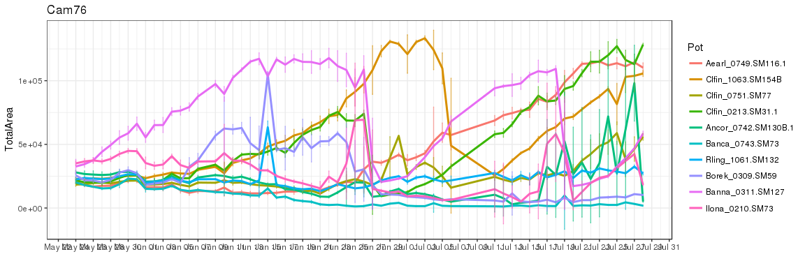

     [1] -1.00000000 -0.95238095 -0.90476190 -0.66666667 -0.80952381
     [6] -0.76190476 -0.71428571 -0.66666667 -0.61904762 -0.57142857
    [11] -0.52380952 -0.19047619 -0.14285714 -0.28571429 -0.23809524
    [16] -0.28571429 -0.23809524 -0.19047619 -0.14285714 -0.09523810
    [21] -0.04761905

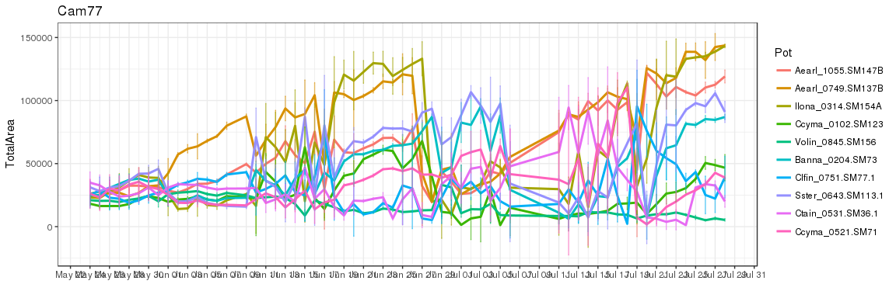

     [1] -0.42857143 -0.28571429 -0.80952381 -0.76190476 -0.52380952
     [6] -0.57142857 -0.61904762 -0.57142857 -0.04761905 -0.19047619
    [11] -0.42857143 -0.19047619 -0.14285714 -0.28571429 -0.23809524
    [16] -0.19047619 -0.14285714 -0.09523810 -0.04761905 -0.09523810
    [21] -0.04761905

     [1] -0.61904762 -0.66666667 -0.61904762 -0.57142857 -0.61904762
     [6] -0.76190476 -0.71428571 -0.66666667  0.14285714 -0.19047619
    [11] -0.52380952 -0.38095238 -0.23809524 -0.38095238 -0.33333333
    [16] -0.28571429 -0.23809524 -0.19047619 -0.14285714 -0.09523810
    [21] -0.04761905

     [1] -1.00000000 -0.66666667 -0.61904762 -0.57142857 -0.52380952
     [6] -0.76190476 -0.71428571 -0.66666667 -0.42857143 -0.47619048
    [11] -0.52380952 -0.47619048 -0.23809524 -0.38095238 -0.33333333
    [16] -0.28571429 -0.23809524 -0.19047619 -0.14285714 -0.09523810
    [21] -0.04761905

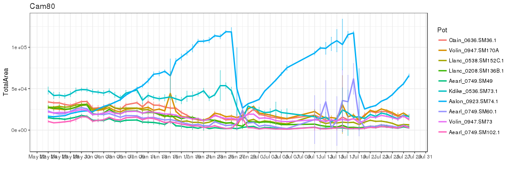

     [1]  0.90476190  0.85714286  0.80952381  0.66666667  0.71428571
     [6]  0.66666667  0.61904762  0.47619048  0.52380952  0.47619048
    [11]  0.33333333  0.38095238  0.33333333  0.19047619  0.14285714
    [16]  0.19047619  0.14285714 -0.19047619 -0.14285714 -0.09523810
    [21] -0.04761905

     [1]  0.80952381  0.76190476  0.80952381  0.76190476  0.71428571
     [6]  0.66666667  0.61904762  0.38095238  0.42857143  0.28571429
    [11] -0.04761905 -0.09523810 -0.14285714 -0.28571429 -0.33333333
    [16] -0.28571429 -0.23809524 -0.09523810 -0.04761905 -0.09523810
    [21] -0.04761905

     [1] -0.42857143 -0.28571429 -0.42857143  0.09523810  0.14285714
     [6]  0.00000000 -0.04761905  0.00000000  0.33333333  0.38095238
    [11]  0.14285714  0.19047619  0.23809524  0.09523810  0.04761905
    [16] -0.28571429 -0.23809524 -0.09523810 -0.04761905 -0.09523810
    [21] -0.04761905

     [1]  0.71428571  0.76190476  0.80952381  0.76190476  0.61904762
     [6]  0.66666667  0.52380952  0.47619048  0.52380952  0.47619048
    [11]  0.42857143  0.38095238  0.33333333  0.19047619  0.14285714
    [16]  0.00000000  0.14285714  0.09523810  0.04761905  0.00000000
    [21] -0.04761905

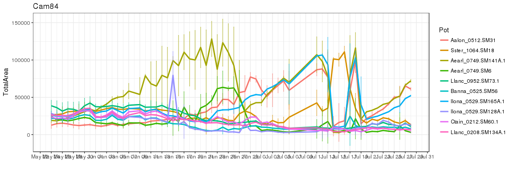

     [1]  0.90476190  0.28571429 -0.14285714 -0.66666667 -0.61904762
     [6]  0.38095238 -0.04761905 -0.47619048 -0.04761905  0.38095238
    [11] -0.42857143 -0.09523810 -0.04761905 -0.38095238 -0.33333333
    [16] -0.28571429 -0.23809524 -0.19047619 -0.14285714 -0.09523810
    [21] -0.04761905

     [1]  0.33333333  0.19047619  0.23809524 -0.09523810 -0.14285714
     [6] -0.19047619 -0.71428571 -0.66666667 -0.61904762 -0.09523810
    [11] -0.52380952 -0.47619048 -0.23809524 -0.38095238 -0.33333333
    [16] -0.28571429 -0.23809524 -0.19047619 -0.14285714 -0.09523810
    [21] -0.04761905

     [1]  0.42857143  0.47619048  0.52380952  0.76190476  0.33333333
     [6]  0.28571429 -0.04761905  0.00000000 -0.04761905  0.28571429
    [11]  0.14285714  0.28571429  0.33333333  0.28571429  0.23809524
    [16]  0.00000000 -0.04761905 -0.19047619 -0.14285714 -0.09523810
    [21] -0.04761905

     [1]  0.80952381  0.85714286  0.80952381  0.76190476  0.71428571
     [6]  0.57142857  0.42857143  0.19047619  0.33333333  0.28571429
    [11] -0.14285714 -0.28571429 -0.23809524 -0.28571429 -0.33333333
    [16] -0.09523810 -0.14285714 -0.09523810 -0.04761905 -0.09523810
    [21] -0.04761905

     [1] -0.42857143 -0.38095238 -0.04761905  0.00000000  0.04761905
     [6] -0.19047619 -0.14285714 -0.09523810 -0.04761905  0.19047619
    [11]  0.04761905  0.09523810  0.33333333  0.19047619  0.23809524
    [16]  0.00000000 -0.04761905  0.00000000 -0.04761905 -0.09523810
    [21] -0.04761905

     [1] -0.33333333 -0.38095238 -0.04761905  0.38095238 -0.14285714
     [6] -0.47619048 -0.71428571 -0.66666667 -0.33333333  0.00000000
    [11] -0.23809524 -0.19047619  0.04761905  0.00000000 -0.04761905
    [16] -0.28571429 -0.23809524 -0.19047619 -0.14285714 -0.09523810
    [21] -0.04761905

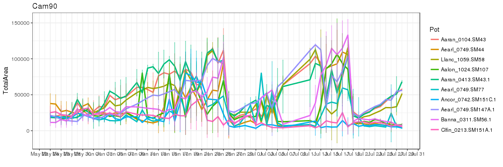

     [1]  0.36363636  0.31818182 -0.45454545 -0.68181818 -0.81818182
     [6] -0.50000000 -0.54545455 -0.68181818 -0.45454545 -0.31818182
    [11] -0.54545455 -0.40909091 -0.36363636 -0.40909091 -0.36363636
    [16] -0.31818182 -0.27272727 -0.22727273 -0.18181818 -0.13636364
    [21] -0.09090909 -0.04545455

     [1] -1.00000000 -0.95454545 -0.90909091 -0.86363636 -0.81818182
     [6] -0.77272727 -0.72727273 -0.68181818 -0.63636364 -0.59090909
    [11] -0.54545455 -0.50000000 -0.45454545 -0.31818182 -0.27272727
    [16] -0.22727273 -0.18181818 -0.13636364  0.00000000  0.04545455
    [21]  0.00000000 -0.04545455

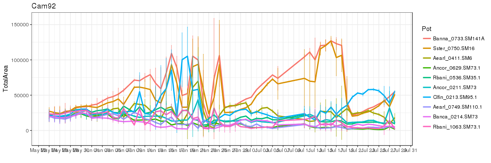

     [1] -0.90909091 -0.77272727 -0.63636364 -0.50000000 -0.63636364
     [6] -0.68181818 -0.63636364 -0.59090909 -0.54545455 -0.50000000
    [11] -0.45454545 -0.13636364 -0.09090909 -0.31818182 -0.27272727
    [16] -0.22727273 -0.18181818 -0.13636364 -0.18181818 -0.13636364
    [21] -0.09090909 -0.04545455

     [1] -0.27272727  0.04545455  0.09090909  0.13636364  0.18181818
     [6]  0.04545455 -0.09090909 -0.04545455  0.09090909  0.31818182
    [11]  0.18181818  0.31818182  0.36363636 -0.22727273 -0.18181818
    [16] -0.04545455 -0.27272727 -0.13636364 -0.18181818 -0.13636364
    [21] -0.09090909 -0.04545455

     [1]  0.90909091  0.86363636  0.81818182  0.77272727  0.54545455
     [6]  0.59090909  0.36363636  0.22727273  0.36363636  0.22727273
    [11]  0.00000000 -0.40909091 -0.36363636  0.04545455 -0.18181818
    [16] -0.31818182  0.09090909 -0.04545455 -0.18181818 -0.13636364
    [21] -0.09090909 -0.04545455

     [1] -1.00000000 -0.95454545 -0.90909091 -0.86363636 -0.81818182
     [6] -0.68181818 -0.72727273 -0.68181818 -0.45454545 -0.13636364
    [11] -0.18181818 -0.04545455  0.09090909 -0.31818182 -0.09090909
    [16] -0.22727273 -0.18181818 -0.22727273 -0.18181818 -0.13636364
    [21] -0.09090909 -0.04545455

     [1] -0.90 -0.85 -0.80 -0.75 -0.70 -0.65 -0.60 -0.55 -0.10 -0.05 -0.20
    [12] -0.05  0.00 -0.25  0.00 -0.25 -0.10 -0.05 -0.10 -0.05

     [1] -0.45454545 -0.40909091 -0.36363636 -0.22727273 -0.27272727
     [6] -0.59090909 -0.72727273 -0.68181818 -0.36363636 -0.22727273
    [11] -0.45454545 -0.13636364 -0.09090909 -0.31818182 -0.09090909
    [16] -0.31818182 -0.27272727 -0.22727273 -0.18181818 -0.13636364
    [21] -0.09090909 -0.04545455

     [1] -0.81818182 -0.50000000 -0.63636364 -0.59090909 -0.36363636
     [6] -0.22727273 -0.45454545 -0.50000000 -0.18181818  0.04545455
    [11] -0.09090909 -0.04545455 -0.09090909 -0.04545455 -0.09090909
    [16] -0.13636364  0.18181818 -0.04545455  0.00000000  0.04545455
    [21] -0.09090909 -0.04545455

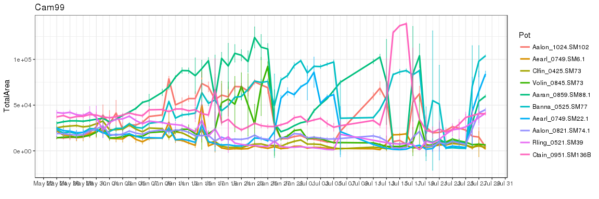

     [1] -0.18181818 -0.40909091 -0.45454545 -0.50000000 -0.54545455
     [6] -0.68181818 -0.72727273 -0.68181818 -0.63636364 -0.59090909
    [11] -0.54545455 -0.50000000 -0.45454545 -0.40909091 -0.36363636
    [16] -0.31818182 -0.27272727 -0.22727273 -0.18181818 -0.13636364
    [21] -0.09090909 -0.04545455

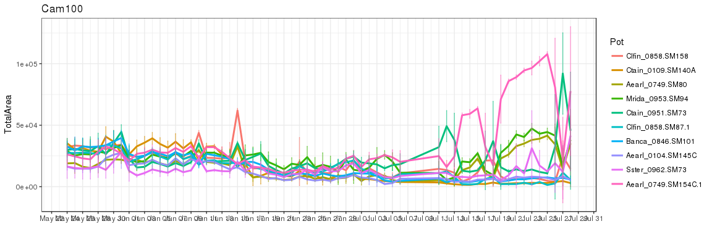

     [1]  0.45454545  0.40909091  0.54545455  0.59090909  0.63636364
     [6]  0.68181818  0.63636364  0.50000000  0.45454545  0.50000000
    [11]  0.45454545  0.31818182  0.36363636  0.22727273  0.27272727
    [16] -0.04545455  0.00000000 -0.04545455 -0.09090909 -0.13636364
    [21]  0.00000000 -0.04545455

     [1] -0.45454545 -0.22727273 -0.18181818 -0.50000000 -0.45454545
     [6] -0.22727273 -0.45454545 -0.50000000 -0.45454545 -0.13636364
    [11] -0.54545455 -0.50000000 -0.27272727 -0.40909091 -0.36363636
    [16] -0.31818182 -0.27272727 -0.22727273 -0.18181818 -0.13636364
    [21] -0.09090909 -0.04545455

     [1] -0.54545455 -0.68181818 -0.63636364 -0.59090909 -0.72727273
     [6] -0.77272727 -0.72727273 -0.68181818 -0.45454545 -0.59090909
    [11] -0.54545455 -0.13636364  0.09090909  0.13636364  0.18181818
    [16] -0.31818182 -0.09090909 -0.22727273 -0.18181818 -0.13636364
    [21] -0.09090909 -0.04545455

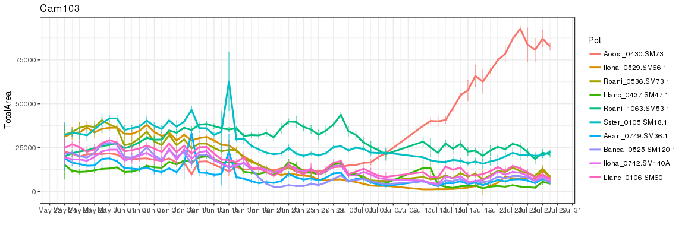

     [1] -0.27272727 -0.13636364  0.18181818 -0.04545455 -0.18181818
     [6] -0.04545455  0.00000000 -0.04545455  0.00000000  0.50000000
    [11]  0.09090909  0.22727273  0.18181818  0.22727273  0.27272727
    [16]  0.13636364  0.18181818  0.13636364  0.09090909  0.04545455
    [21]  0.00000000 -0.04545455

     [1]  0.27272727  0.22727273  0.36363636  0.40909091  0.45454545
     [6]  0.50000000  0.36363636  0.31818182  0.45454545  0.50000000
    [11]  0.27272727  0.31818182  0.36363636  0.22727273  0.27272727
    [16]  0.22727273  0.18181818  0.13636364  0.00000000  0.04545455
    [21]  0.00000000 -0.04545455

     [1] -1.00000000 -0.59090909 -0.36363636 -0.40909091 -0.54545455
     [6] -0.77272727 -0.72727273 -0.68181818 -0.36363636 -0.31818182
    [11] -0.54545455 -0.31818182 -0.18181818 -0.40909091 -0.27272727
    [16] -0.31818182 -0.27272727 -0.22727273 -0.18181818 -0.13636364
    [21] -0.09090909 -0.04545455

     [1] -0.27272727 -0.13636364  0.09090909  0.04545455 -0.09090909
     [6] -0.59090909 -0.63636364 -0.50000000 -0.09090909 -0.13636364
    [11] -0.45454545 -0.13636364 -0.09090909 -0.40909091 -0.18181818
    [16] -0.31818182 -0.27272727 -0.22727273 -0.18181818 -0.04545455
    [21] -0.09090909 -0.04545455

     [1] -1.00000000 -0.77272727 -0.72727273 -0.50000000 -0.63636364
     [6] -0.77272727 -0.72727273 -0.68181818 -0.54545455 -0.40909091
    [11] -0.45454545 -0.31818182 -0.27272727 -0.40909091 -0.27272727
    [16] -0.31818182 -0.27272727 -0.22727273 -0.18181818 -0.13636364
    [21] -0.09090909 -0.04545455

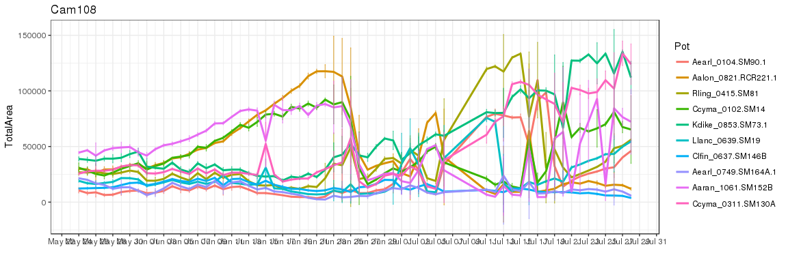

     [1]  0.45454545  0.77272727  0.45454545  0.50000000  0.54545455
     [6]  0.22727273  0.09090909  0.04545455  0.27272727  0.04545455
    [11] -0.18181818 -0.31818182 -0.36363636 -0.40909091 -0.36363636
    [16] -0.13636364 -0.27272727  0.04545455  0.09090909  0.04545455
    [21] -0.09090909 -0.04545455

     [1] -0.72727273 -0.86363636 -0.54545455 -0.59090909 -0.54545455
     [6] -0.31818182 -0.36363636 -0.68181818 -0.36363636  0.13636364
    [11]  0.00000000  0.13636364  0.18181818 -0.22727273 -0.27272727
    [16]  0.13636364 -0.27272727 -0.22727273 -0.18181818 -0.13636364
    [21] -0.09090909 -0.04545455

     [1] -0.90909091 -0.59090909 -0.54545455 -0.50000000 -0.45454545
     [6] -0.68181818 -0.63636364 -0.59090909 -0.45454545 -0.22727273
    [11] -0.45454545 -0.31818182 -0.18181818 -0.31818182 -0.18181818
    [16] -0.22727273  0.00000000 -0.13636364 -0.09090909 -0.04545455
    [21]  0.00000000 -0.04545455

     [1]  0.72727273  0.77272727  0.72727273  0.68181818  0.72727273
     [6]  0.68181818  0.63636364  0.50000000  0.45454545  0.40909091
    [11]  0.36363636  0.31818182  0.27272727  0.13636364  0.18181818
    [16] -0.04545455 -0.09090909 -0.22727273 -0.09090909 -0.13636364
    [21] -0.09090909 -0.04545455

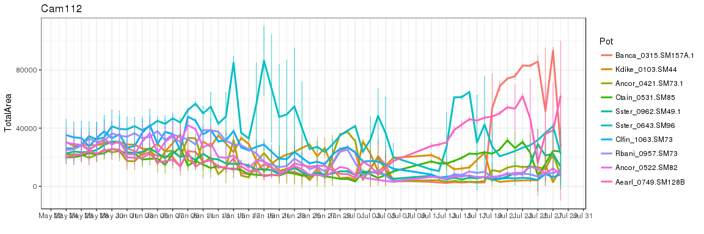

     [1] -0.45454545 -0.13636364  0.36363636  0.40909091  0.36363636
     [6] -0.13636364 -0.36363636 -0.31818182 -0.27272727 -0.13636364
    [11] -0.45454545 -0.22727273 -0.18181818 -0.31818182 -0.18181818
    [16] -0.31818182 -0.18181818 -0.22727273 -0.18181818 -0.13636364
    [21] -0.09090909 -0.04545455

     [1] -0.90909091 -0.40909091 -0.81818182 -0.86363636 -0.27272727
     [6] -0.77272727 -0.72727273 -0.68181818 -0.36363636 -0.31818182
    [11] -0.54545455 -0.31818182 -0.27272727 -0.40909091 -0.27272727
    [16] -0.31818182 -0.27272727 -0.22727273 -0.18181818 -0.13636364
    [21]  0.00000000 -0.04545455

     [1]  0.81818182  0.77272727  0.72727273  0.68181818  0.72727273
     [6]  0.68181818  0.54545455  0.50000000  0.54545455  0.50000000
    [11]  0.27272727  0.31818182  0.36363636  0.22727273  0.27272727
    [16] -0.13636364 -0.09090909 -0.22727273 -0.18181818 -0.13636364
    [21] -0.09090909 -0.04545455

     [1] -0.72727273 -0.68181818 -0.45454545 -0.50000000 -0.36363636
     [6] -0.50000000 -0.63636364 -0.68181818 -0.18181818 -0.40909091
    [11] -0.54545455 -0.50000000 -0.18181818 -0.40909091 -0.27272727
    [16]  0.13636364 -0.27272727 -0.22727273 -0.18181818 -0.13636364
    [21] -0.09090909 -0.04545455

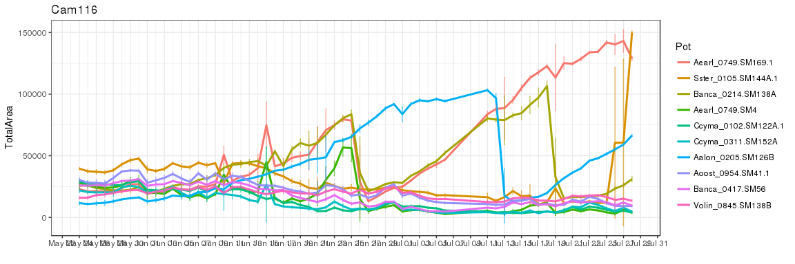

     [1] -0.63636364 -0.86363636 -0.72727273 -0.77272727 -0.63636364
     [6] -0.31818182 -0.45454545 -0.40909091 -0.18181818 -0.13636364
    [11] -0.09090909  0.04545455  0.09090909  0.04545455 -0.18181818
    [16] -0.31818182 -0.27272727 -0.22727273 -0.18181818 -0.13636364
    [21] -0.09090909 -0.04545455

     [1] -0.72727273 -0.68181818 -0.63636364 -0.59090909 -0.54545455
     [6] -0.77272727 -0.72727273 -0.68181818 -0.54545455 -0.50000000
    [11] -0.54545455 -0.50000000 -0.36363636 -0.40909091 -0.36363636
    [16] -0.31818182 -0.27272727 -0.22727273 -0.18181818 -0.13636364
    [21] -0.09090909 -0.04545455

     [1]  0.54545455  0.59090909  0.45454545 -0.04545455 -0.81818182
     [6] -0.31818182 -0.63636364 -0.68181818 -0.63636364 -0.40909091
    [11] -0.54545455 -0.40909091 -0.18181818 -0.40909091 -0.36363636
    [16] -0.31818182 -0.27272727 -0.22727273 -0.18181818 -0.13636364
    [21] -0.09090909 -0.04545455

     [1] -0.90909091 -0.86363636 -0.72727273 -0.77272727 -0.72727273
     [6] -0.68181818 -0.63636364 -0.59090909 -0.54545455 -0.50000000
    [11] -0.45454545 -0.40909091 -0.27272727 -0.13636364 -0.27272727
    [16] -0.22727273 -0.09090909 -0.04545455  0.00000000 -0.13636364
    [21] -0.09090909 -0.04545455

     [1] -1.00000000 -0.95454545 -0.90909091 -0.86363636 -0.81818182
     [6] -0.68181818 -0.63636364 -0.68181818 -0.63636364 -0.40909091
    [11] -0.45454545 -0.22727273 -0.09090909 -0.31818182 -0.27272727
    [16] -0.31818182 -0.27272727 -0.22727273 -0.18181818 -0.13636364
    [21] -0.09090909 -0.04545455

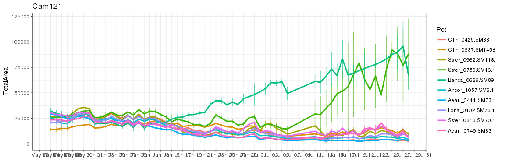

     [1] -1.00000000 -0.95454545 -0.90909091 -0.86363636 -0.81818182
     [6] -0.77272727 -0.72727273 -0.68181818 -0.54545455 -0.50000000
    [11] -0.54545455 -0.40909091 -0.18181818 -0.31818182 -0.27272727
    [16] -0.31818182 -0.27272727 -0.22727273 -0.18181818 -0.13636364
    [21] -0.09090909 -0.04545455

     [1] -0.63636364 -0.59090909 -0.54545455 -0.50000000 -0.45454545
     [6] -0.31818182 -0.45454545 -0.50000000 -0.36363636 -0.13636364
    [11] -0.09090909 -0.22727273  0.09090909 -0.04545455  0.00000000
    [16] -0.04545455 -0.09090909 -0.04545455  0.00000000  0.04545455
    [21] -0.09090909 -0.04545455

     [1] -1.00000000 -0.95454545 -0.90909091 -0.86363636 -0.81818182
     [6] -0.68181818 -0.72727273 -0.68181818 -0.54545455 -0.22727273
    [11] -0.36363636 -0.22727273  0.09090909 -0.22727273  0.09090909
    [16] -0.13636364 -0.18181818 -0.13636364 -0.18181818  0.04545455
    [21] -0.09090909 -0.04545455

     [1] -0.45454545  0.04545455 -0.36363636 -0.22727273 -0.63636364
     [6] -0.77272727 -0.72727273 -0.04545455 -0.18181818 -0.40909091
    [11] -0.45454545 -0.40909091 -0.18181818 -0.31818182 -0.18181818
    [16] -0.31818182 -0.27272727 -0.22727273 -0.18181818 -0.13636364
    [21] -0.09090909 -0.04545455

     [1] -0.72727273 -0.68181818 -0.63636364 -0.59090909 -0.54545455
     [6] -0.50000000 -0.45454545 -0.40909091 -0.36363636 -0.13636364
    [11] -0.27272727 -0.13636364  0.00000000 -0.04545455  0.18181818
    [16] -0.04545455  0.18181818  0.04545455 -0.09090909 -0.04545455
    [21]  0.00000000 -0.04545455

     [1]  0.63636364  0.50000000  0.54545455  0.50000000  0.45454545
     [6]  0.31818182  0.36363636  0.22727273  0.27272727  0.13636364
    [11] -0.54545455 -0.22727273 -0.09090909 -0.40909091 -0.36363636
    [16] -0.13636364 -0.09090909 -0.22727273 -0.18181818 -0.13636364
    [21] -0.09090909 -0.04545455

     [1]  0.18181818  0.50000000  0.54545455  0.59090909  0.45454545
     [6]  0.22727273  0.27272727  0.31818182  0.36363636  0.40909091
    [11]  0.45454545  0.31818182  0.18181818  0.22727273  0.18181818
    [16] -0.04545455  0.00000000 -0.22727273 -0.09090909 -0.13636364
    [21]  0.00000000 -0.04545455

     [1]  0.54545455 -0.59090909 -0.45454545 -0.59090909 -0.36363636
     [6]  0.04545455 -0.63636364 -0.68181818 -0.63636364 -0.04545455
    [11] -0.36363636 -0.31818182  0.00000000 -0.40909091 -0.09090909
    [16] -0.31818182 -0.27272727 -0.22727273 -0.18181818 -0.13636364
    [21] -0.09090909 -0.04545455

     [1] -0.72727273 -0.86363636 -0.81818182 -0.77272727 -0.72727273
     [6] -0.59090909 -0.63636364 -0.68181818 -0.63636364 -0.50000000
    [11] -0.54545455 -0.50000000 -0.45454545 -0.40909091 -0.27272727
    [16] -0.31818182 -0.27272727 -0.22727273 -0.18181818 -0.13636364
    [21] -0.09090909 -0.04545455

     [1] -1.00000000 -0.95454545 -0.90909091 -0.59090909 -0.81818182
     [6] -0.77272727 -0.72727273 -0.68181818 -0.63636364 -0.59090909
    [11] -0.54545455 -0.50000000 -0.36363636 -0.40909091  0.27272727
    [16] -0.31818182 -0.18181818 -0.22727273 -0.18181818 -0.13636364
    [21] -0.09090909 -0.04545455

     [1]  0.45454545  0.50000000  0.54545455  0.50000000  0.09090909
     [6] -0.04545455 -0.36363636 -0.31818182  0.45454545  0.50000000
    [11]  0.00000000  0.04545455  0.18181818 -0.40909091 -0.09090909
    [16] -0.31818182 -0.09090909 -0.13636364 -0.18181818 -0.13636364
    [21] -0.09090909 -0.04545455

     [1]  0.72727273  0.77272727  0.72727273  0.59090909  0.36363636
     [6] -0.04545455 -0.27272727 -0.68181818  0.00000000  0.04545455
    [11] -0.45454545 -0.22727273  0.09090909 -0.22727273  0.00000000
    [16] -0.31818182 -0.18181818 -0.22727273 -0.18181818 -0.13636364
    [21] -0.09090909 -0.04545455

     [1] -1.00000000 -0.95454545 -0.90909091 -0.77272727 -0.81818182
     [6] -0.77272727 -0.72727273 -0.68181818 -0.09090909 -0.04545455
    [11] -0.45454545 -0.31818182 -0.09090909 -0.40909091 -0.09090909
    [16] -0.31818182 -0.18181818 -0.22727273 -0.18181818 -0.13636364
    [21] -0.09090909 -0.04545455

     [1]  0.72727273  0.13636364  0.09090909  0.59090909 -0.09090909
     [6] -0.31818182 -0.27272727 -0.22727273  0.09090909  0.22727273
    [11] -0.09090909 -0.04545455  0.18181818 -0.31818182  0.00000000
    [16] -0.31818182 -0.27272727 -0.22727273 -0.18181818 -0.13636364
    [21] -0.09090909 -0.04545455

     [1] -0.45454545  0.13636364  0.18181818  0.40909091 -0.27272727
     [6] -0.59090909 -0.72727273 -0.68181818 -0.36363636 -0.31818182
    [11] -0.54545455 -0.50000000 -0.27272727 -0.22727273 -0.18181818
    [16] -0.31818182 -0.27272727 -0.22727273 -0.18181818 -0.13636364
    [21] -0.09090909 -0.04545455

     [1] -1.00000000 -0.95454545 -0.90909091 -0.86363636 -0.81818182
     [6] -0.77272727 -0.72727273 -0.22727273 -0.18181818 -0.59090909
    [11] -0.54545455 -0.50000000 -0.45454545 -0.40909091 -0.36363636
    [16] -0.31818182 -0.27272727 -0.22727273 -0.18181818 -0.13636364
    [21] -0.09090909 -0.04545455

     [1] -0.90909091 -0.22727273 -0.54545455  0.22727273 -0.45454545
     [6] -0.68181818 -0.63636364 -0.68181818 -0.63636364 -0.59090909
    [11] -0.54545455 -0.50000000 -0.45454545 -0.40909091 -0.36363636
    [16] -0.31818182 -0.27272727 -0.22727273 -0.18181818 -0.13636364
    [21] -0.09090909 -0.04545455

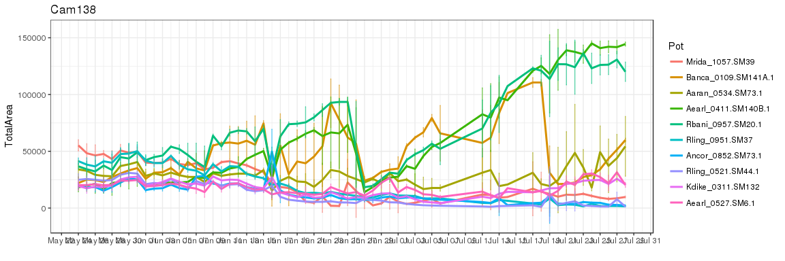

     [1] -0.72727273 -0.86363636 -0.72727273 -0.59090909 -0.54545455
     [6] -0.68181818 -0.63636364 -0.68181818 -0.63636364 -0.59090909
    [11] -0.54545455 -0.50000000 -0.45454545 -0.40909091  0.09090909
    [16] -0.04545455 -0.09090909 -0.22727273 -0.18181818 -0.04545455
    [21] -0.09090909 -0.04545455

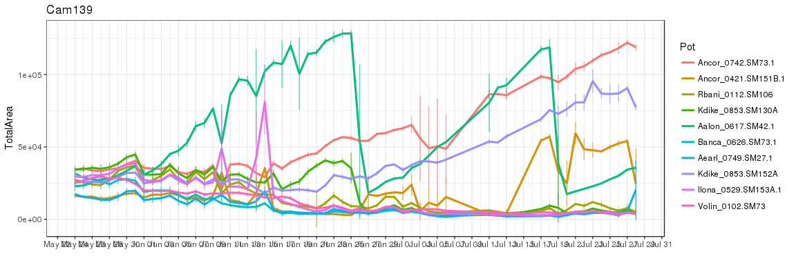

     [1] -1.00000000 -0.95454545 -0.90909091 -0.86363636 -0.72727273
     [6] -0.68181818 -0.63636364 -0.68181818 -0.63636364 -0.22727273
    [11] -0.45454545 -0.04545455 -0.36363636 -0.40909091 -0.36363636
    [16] -0.31818182 -0.27272727 -0.22727273 -0.18181818 -0.13636364
    [21] -0.09090909 -0.04545455

     [1] -1.00000000 -0.95454545 -0.90909091 -0.59090909 -0.81818182
     [6] -0.77272727 -0.45454545  0.22727273  0.09090909 -0.13636364
    [11] -0.54545455 -0.50000000 -0.36363636 -0.40909091 -0.27272727
    [16] -0.22727273 -0.09090909 -0.22727273 -0.18181818 -0.13636364
    [21] -0.09090909 -0.04545455

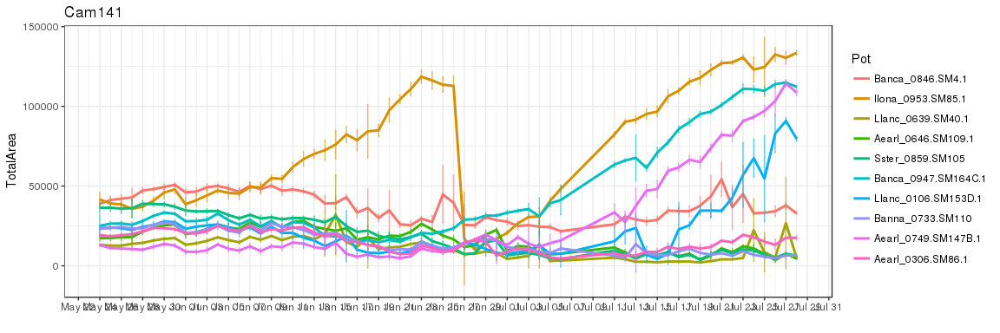

     [1] -0.54545455 -0.59090909 -0.72727273 -0.68181818 -0.63636364
     [6] -0.59090909 -0.54545455 -0.50000000 -0.45454545 -0.40909091
    [11] -0.36363636  0.04545455  0.09090909 -0.04545455 -0.18181818
    [16] -0.31818182 -0.27272727 -0.22727273 -0.18181818 -0.13636364
    [21] -0.09090909 -0.04545455

     [1] -0.36363636  0.40909091  0.45454545  0.50000000  0.45454545
     [6]  0.31818182  0.27272727 -0.13636364  0.36363636  0.40909091
    [11] -0.18181818 -0.13636364 -0.09090909 -0.04545455  0.00000000
    [16] -0.22727273 -0.27272727 -0.22727273 -0.18181818 -0.13636364
    [21] -0.09090909 -0.04545455

     [1] -0.54545455 -0.50000000 -0.45454545 -0.40909091 -0.36363636
     [6]  0.31818182 -0.27272727  0.04545455 -0.18181818 -0.13636364
    [11] -0.09090909 -0.04545455  0.00000000 -0.22727273 -0.18181818
    [16] -0.13636364 -0.09090909 -0.04545455  0.09090909  0.04545455
    [21]  0.00000000 -0.04545455

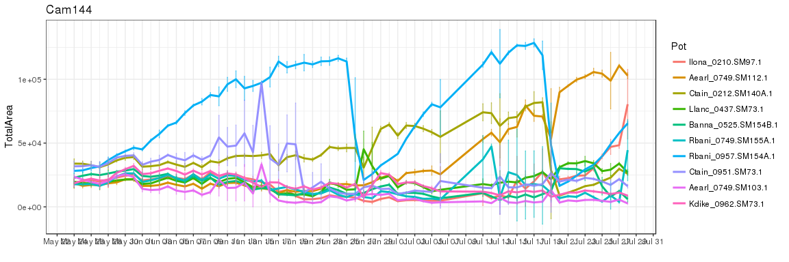

     [1]  0.09090909  0.50000000  0.27272727  0.40909091  0.63636364
     [6]  0.31818182  0.45454545  0.40909091  0.45454545  0.50000000
    [11]  0.18181818  0.13636364  0.18181818  0.22727273  0.27272727
    [16]  0.13636364  0.18181818  0.13636364 -0.09090909 -0.04545455
    [21]  0.00000000 -0.04545455

     [1] -1.00000000 -0.86363636 -0.72727273 -0.22727273 -0.18181818
     [6] -0.50000000 -0.72727273 -0.68181818 -0.45454545 -0.13636364
    [11] -0.54545455 -0.40909091 -0.09090909 -0.31818182 -0.27272727
    [16] -0.31818182 -0.27272727 -0.22727273 -0.18181818  0.04545455
    [21] -0.09090909 -0.04545455

    Error in t.test.default(temp1$TotalArea, temp2$TotalArea, alternative = "less"): not enough 'y' observations

             Time                 Pot
    1  2017-05-25   Aearl_0306.SM140B
    2  2017-06-04     Aearl_0749.SM46
    3  2017-05-26    Ancor_0852.SM169
    4  2017-06-01   Aearl_0749.SM154C
    5  2017-06-06   Sster_0750.SM133A
    6  2017-05-29    Aalon_0821.SM158
    7  2017-05-31   Borek_0309.SM151B
    8  2017-06-01    Aearl_0749.SM156
    9  2017-05-28    Aearl_0749.SM119
    10 2017-05-26     Clfin_1063.SM92
    11 2017-05-26    Rbani_0432.SM111
    12 2017-05-25     Aalon_0307.SM61
    13 2017-05-26   Aearl_0646.SM147A
    14 2017-05-28   Aearl_0646.SM147A
    15 2017-06-02   Sster_0313.SM144A
    16 2017-06-02   Aalon_0718.SM145A
    17 2017-05-27      Ancor_0953.SM6
    18 2017-05-27    Sster_1064.SM118
    19 2017-05-27      Aearl_0749.SM3
    20 2017-06-02     Aoost_0543.SM25
    21 2017-05-25    Clfin_0637.SM107
    22 2017-06-02     Mrida_0953.SM39
    23 2017-05-25   Aaran_0413.SM137B
    24 2017-06-07     Rbani_0112.SM73
    25 2017-05-27    Mrida_0851.SM150
    26 2017-05-29    Mrida_0851.SM150
    27 2017-05-25     Mrida_0426.SM93
    28 2017-05-24   Ancor_0522.SM147B
    29 2017-05-27 Borek_0309.SM151B.1
    30 2017-06-02     Sster_0750.SM57
    31 2017-05-28     Aalon_0923.SM73
    32 2017-05-27     Aalon_0617.SM31
    33 2017-05-27     Aalon_0307.SM68
    34 2017-06-01   Ccyma_0102.SM122A
    35 2017-06-04   Ccyma_0102.SM122A
    36 2017-06-06   Sster_0962.SM168C
    37 2017-05-29     Banna_0525.SM73
    38 2017-05-31     Banna_0525.SM73
    39 2017-05-24   Banca_0947.SM141A
    40 2017-05-26     Ancor_0421.SM86
    41 2017-05-28   Banna_0627.SM84.1
    42 2017-05-24    Llanc_0437.SM116
    43 2017-05-24    Banca_0109.SM115
    44 2017-05-26    Banca_0109.SM115
    45 2017-06-02    Aearl_0749.SM158
    46 2017-05-26   Aalon_0821.RCR221
    47 2017-05-24   Clfin_0320.SM145A
    48 2017-05-24     Rling_1061.SM73
    49 2017-05-27    Aalon_0307.SM100
    50 2017-05-25   Aearl_0749.SM126B
    51 2017-06-06     Aearl_0411.SM73
    52 2017-05-27    Aearl_0749.SM118
    53 2017-05-24     Sster_0313.SM70
    54 2017-06-06    Ancor_0742.SM169
    55 2017-05-24   Rbani_1063.SM154A
    56 2017-05-29    Volin_0203.SM105
    57 2017-06-02     Ilona_0427.SM53
    58 2017-05-29     Aalon_0408.SM38
    59 2017-06-02     Aalon_0408.SM38
    60 2017-05-25     Aearl_0749.SM25
    61 2017-05-25   Ancor_0852.SM140B
    62 2017-05-27    Kdike_0103.SM117
    63 2017-05-24     Aoost_0430.SM58
    64 2017-05-25     Kdike_0311.SM73
    65 2017-05-24   Kdike_0853.SM122A
    66 2017-05-27     Mrida_0210.SM73
    67 2017-05-24   Llanc_0538.SM21.1
    68 2017-06-08   Aearl_0749.SM145B
    69 2017-05-26   Ilona_0742.SM128A
    70 2017-05-25    Ilona_0210.SM104
    71 2017-05-24  Clfin_0751.SM158.1
    72 2017-05-27     Aoost_0104.SM21
    73 2017-05-27   Aearl_0749.SM151A
    74 2017-05-31    Clfin_0961.SM110
    75 2017-05-27     Ancor_0317.SM86
    76 2017-05-29     Aoost_0852.SM18
    77 2017-05-28   Clfin_0425.SM145A

### Growth curves for all Cameras

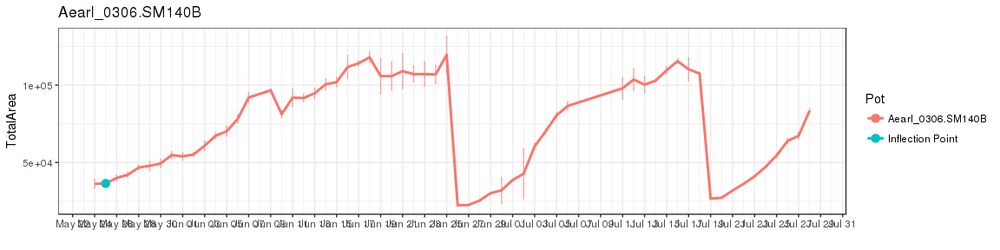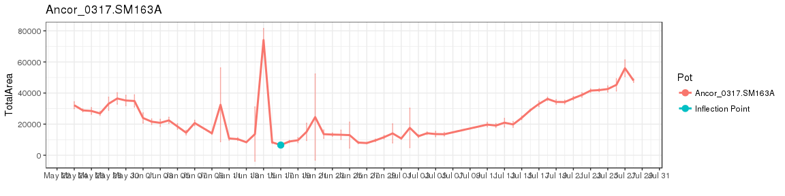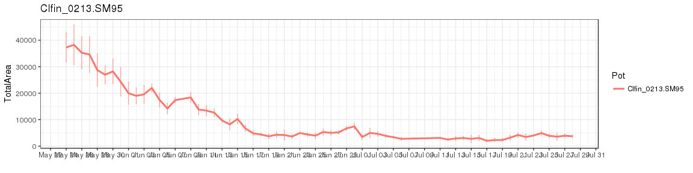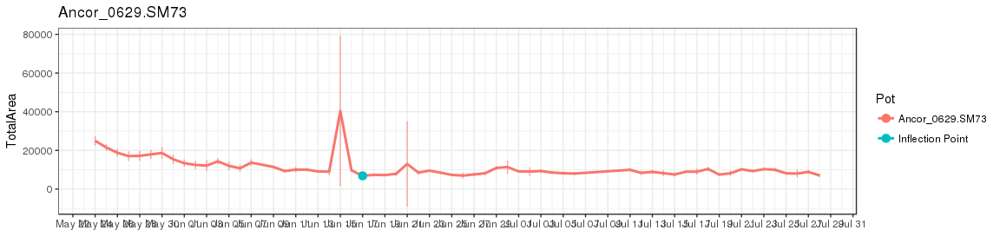
